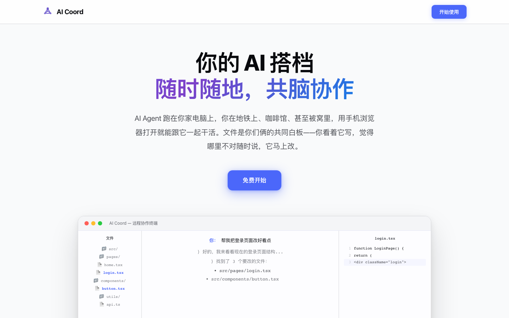

<p align="center">
  <h1 align="center">AI Coord</h1>
  <p align="center">
    <strong>Control your local AI Agents from anywhere.</strong>
  </p>
  <p align="center">
    Monitor and interact with Claude Code, Codex CLI, and more — directly from your browser or phone.
  </p>
  <p align="center">
    <a href="https://aicoord.cn">Website</a> ·
    <a href="#quick-start">Quick Start</a> ·
    <a href="README.zh-CN.md">中文文档</a>
  </p>
</p>

<br/>

<p align="center">
  
</p>

<br/>

## Why AI Coord?

You run Claude Code or Codex on your local machine. But what if you step away? What if you want to check progress from your phone? Or use your iPad to review code changes?

**AI Coord gives you a remote control for your local AI Agents — no SSH, no VPN, just a browser.**

## Features

- 🌐 **Browser-based control** — Interact with your AI agents from any device with a browser
- 📱 **Mobile-friendly** — Monitor agent progress on your phone in real-time
- 🔒 **Privacy-first architecture** — The hub is a pure relay; your code and conversations never touch our servers
- 🚀 **Multi-framework support** — Works with Claude Code, Codex CLI, Hermes, OpenClaw, and more
- 📁 **File system access** — Browse, view, and edit files in your workspace directly from the browser
- 💬 **Real-time streaming** — See agent responses as they're generated, with syntax highlighting
- 🖥️ **Multi-machine** — Connect multiple machines, each with multiple agents

## Architecture

```
┌──────────────┐     WSS     ┌──────────────┐     WSS     ┌──────────────┐     WS     ┌────────────┐
│   Browser    │────────────▶│  AI Coord    │────────────▶│   Sidecar    │───────────▶│   Agent     │
│  / Tauri App │             │    Hub       │             │   (Local)    │            │ (Claude etc)│
└──────────────┘             └──────────────┘             └──────────────┘            └────────────┘
     Any device                 Cloud Relay                Your machine              Your machine
```

**The Hub is a pure relay** — it routes messages between your browser and your local Sidecar. It never parses, stores, or processes your agent conversations or code.

## Supported Frameworks

| Framework | Type | Status |
|-----------|------|--------|
| [Claude Code](https://docs.anthropic.com/en/docs/claude-code) | CLI Agent | ✅ Supported |
| [Codex CLI](https://github.com/openai/codex) | CLI Agent | ✅ Supported |
| [Hermes](https://github.com/NousResearch/hermes-agent) | AI Agent | ✅ Supported |
| [OpenClaw](https://github.com/openclaw/openclaw) | Agent Framework | ✅ Supported |

## Quick Start

### 1. Create an account

Sign up at [aicoord.cn](https://aicoord.cn) — it's free.

### 2. Install Sidecar

Sidecar is a lightweight agent that runs on your machine and connects your local AI agents to AI Coord.

**macOS (Recommended):**

Download the DMG for your Mac:

- [Apple Silicon (M1/M2/M3/M4)](https://aicoord.cn/downloads/AI_Coord_Sidecar_Latest_Apple_Silicon.dmg)
- [Intel Mac](https://aicoord.cn/downloads/AI_Coord_Sidecar_Latest_Intel.dmg)

**Linux / macOS (CLI):**

```bash
curl -fsSL https://aicoord.cn/install.sh | sh
```

Or download manually:

| Platform | Download |
|----------|----------|
| macOS Apple Silicon | [sidecar-darwin-arm64](https://aicoord.cn/downloads/sidecar-darwin-arm64) |
| macOS Intel | [sidecar-darwin-amd64](https://aicoord.cn/downloads/sidecar-darwin-amd64) |
| Linux AMD64 | [sidecar-linux-amd64](https://aicoord.cn/downloads/sidecar-linux-amd64) |
| Linux ARM64 | [sidecar-linux-arm64](https://aicoord.cn/downloads/sidecar-linux-arm64) |

### 3. Connect and use

1. Open Sidecar and sign in with your AI Coord account
2. Sidecar will automatically discover running AI agents on your machine
3. Go to [aicoord.cn](https://aicoord.cn) — your agents are now accessible from any browser

That's it. No configuration files, no port forwarding, no SSH tunnels.

## How It Works

1. **Sidecar** runs on your machine and discovers local AI agents (Claude Code, Codex, etc.)
2. Sidecar connects to the **Hub** via WebSocket with JWT authentication
3. You open **aicoord.cn** in any browser and log in
4. The browser connects to the Hub, which relays messages to your Sidecar
5. Sidecar proxies commands to the AI agent and streams responses back

All traffic is encrypted in transit. The Hub is a dumb relay — it sees encrypted frames, not your code.

## FAQ

**Do I need to open any ports?**

No. Sidecar connects outbound to the Hub. No inbound ports, no firewall changes.

**Is my code sent to your servers?**

No. The Hub is a pure relay. Agent messages pass through encrypted WebSocket frames. We don't parse, log, or store any agent content.

**Does it work on Windows?**

Not yet. Currently supported: macOS (Intel & Apple Silicon) and Linux.

**Can I use it with multiple machines?**

Yes. Install Sidecar on each machine and sign in with the same account. All your agents appear in one dashboard.

**Is it free?**

Yes, currently free during early access.

## Use Cases

- **Monitor from your phone** — Start a long Claude Code task, then check progress from your phone
- **iPad coding** — Use your iPad as a thin client to control Claude Code on your Mac
- **Multi-machine workflows** — Manage AI agents across your laptop, desktop, and servers from one place
- **Team collaboration** — Share agent sessions with teammates for pair programming with AI

## Links

- 🌐 [Website](https://aicoord.cn)
- 🐛 [Report a Bug](https://github.com/moore-c/aicoord/issues/new?template=bug_report.md)
- 💡 [Request a Feature](https://github.com/moore-c/aicoord/issues/new?template=feature_request.md)

## License

This repository contains documentation and distribution files only. The source code for AI Coord components is proprietary. See [LICENSE](LICENSE) for details.

---

<p align="center">
  Made with ❤️ for developers who want their AI agents accessible everywhere.
</p>
